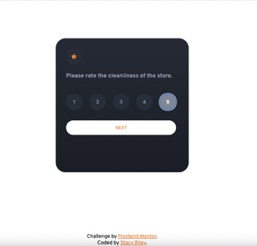

# Frontend Mentor - Interactive rating component solution part 2 

## Table of contents

- [Overview](#overview)
  - [The challenge](#the-challenge)
  - [Screenshot](#screenshot)
  - [Links](#links)
- [My process](#my-process)
  - [Built with](#built-with)
  - [What I learned](#what-i-learned)
  - [Continued development](#continued-development)
  - [Useful resources](#useful-resources)
- [Author](#author)

## Overview
This is an upgraded component from the original challenge.  This code has 5 questions that display along with the form where the user selects a score of 1-5.
 The numbers highlight as the user hovers over them and then when they select a score of 1-5, the number will remain highlighted after clicking.  The start and next buttons highlight when hovered over as well.  When next is clicked, if there is no number selected, the app does nothing.  Once the user scores all the questions, it will hide the rating page and display a thank you page.  

### The challenge

Users should be able to:

- View the optimal layout for the app depending on their device's screen size
- See hover states for all interactive elements on the page
- Select and submit a number rating
- See the "Thank you" card state after submitting a rating

Additional:
- Display survey questions and record score given to each question

### Screenshot





### Links

- Solution URL: [Add solution URL here](https://github.com/Stacy-Riley/multi-question-survey-component)
- Live Site URL: [Add live site URL here](https://stacy-riley.github.io/multi-question-survey-component/)

## My process
I began with the completed challenge and wanted to add questions to it so that I could practice loops and listening events more.

### Built with

- Semantic HTML5 markup
- CSS custom properties
- Flexbox
- Mobile-first workflow


### What I learned
I learned a lot working on this project because it has 2 loops happening at the same time.  A loop for the questions and a loop for the score. One of the issues I faced was if the user clicked a score one time, it would carry that selected score through to other questions even if nothing was pressed for the new question. I knew I needed to remove the "selected" class from the button for each new question but it took me a while to figure out where to put it in the code and how to put it into the code.

```js
 // Display the current question on the page:
function displayQuestion() {
  displaySurveyQuestion.textContent= surveyQuestions[currentQuestion].question;
  //here it connects to buttons and removes the selected class on buttons that come into the question as "selected"
  let buttons = document.querySelectorAll("#fieldset input[type=button]");
  buttons.forEach(button => {
    button.classList.remove("selected");
  })
}
```

### Continued development

I am very much committed to honing my skills in accessing and storing user data effectively, in order to provide valuable insights for the site owner and enhance the overall user experience.


### Useful resources

- [Example resource 1](https://developer.mozilla.org/en-US/docs/Web/API/Element/className) - This helped me applying class names to elements by way of JavaScript.
- [Example resource 2](https://developer.mozilla.org/en-US/docs/Web/HTML/Element/fieldset) - This helped me learn more about the form fieldset element.

## Author

- Website - [Stacy Riley](https://www.createdbystacy.com)
- Frontend Mentor - [@Stacy-Riley](https://www.frontendmentor.io/profile/Stacy-Riley)
- Twitter - [@askstacyriley](https://twitter.com/AskStacyRiley)

